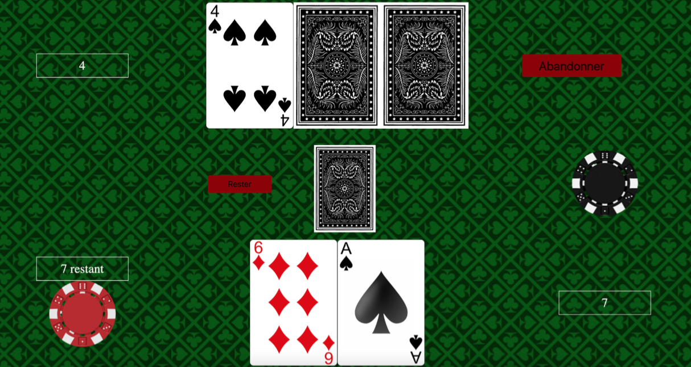
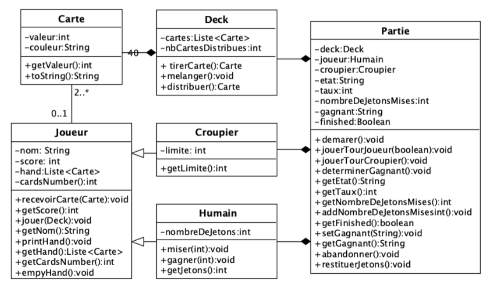

# ARCHIVED Blackjack Game  
>Note: This is an archived repository, some of the functionalities might not work as expected. You can find the code as is.
### Lázár Barta, Laila Laaris
### Spring 2023  

## Opening the files  
If you run the jar, there is nothing you need to do. Run `java -jar JeuDeBlackJackjar.jar` from the main folder.  
 
Otherwise:  
Drag the `Blackjack_API` folder into the IDE _IntelliJ_. If _IntelliJ_ does not recognize the files, mark the `src` folder as `sources root` (right-click on the folder, mark directory as, sources root). 
Most files are located under `src/main/java/ch/info_ii/blackjack_api`.  
In the `.../api/model` folder are the classes used for the game. 
In the `.../service` folder is `GameService.java`, which manages the flow of the game.  
In the `.../api/controller` folder are the files that handle the endpoints, as well as the endpoint documentation. 
In the `src/main/resources/static` folder are the resources for the front end. The card images will be added soon.  

## Running the program  
Run the Java file `BlackJackApiApplication.java` or open the jar. The API will be accessible at `localhost:8080`.  

## Testing the endpoints  
To test the endpoints, import the file `Projet_Info_II.postman_collection.json` from the `API-Postman` folder (from the source) into the _Postman_ application, or make the requests directly from your browser.  
Instructions in the console will guide you.  
To start the game, call the endpoint `/api/start`. The other endpoints are inactive until it is called.  

## Playing the game  
The game interface will guide you through the steps to follow.  

## Game rules:  
Draw cards without exceeding 21. If you do not exceed 21 and have a higher score (sum of card values) than the dealer, you win double your bet. Otherwise, you lose your chips. Except in case of a tie with the dealer, below 22.

## Gameplay

## Structure (class diagram, in French)
